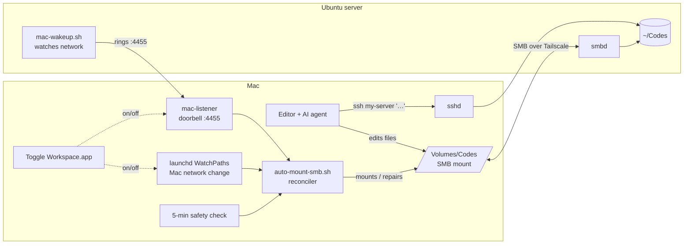

# Remote Workspace

**Code on a Mac, run everything on a Linux server — even with an editor that has no "Remote SSH" mode.**

Google Antigravity (and some other AI editors) can't attach to a remote machine the way VS Code Remote-SSH or Cursor can. This repo is the workaround I use every day:

- **Files** live on an Ubuntu server and appear on the Mac through an **SMB share** — the editor just sees a normal folder.
- **Commands** (builds, installs, git, dev servers) run on the server over **SSH**, enforced by a rules file the AI agent reads.
- The connection is **self-healing**: when either machine's network drops and comes back, the share is remounted within seconds — driven by events, not polling.

The Mac stays cool and quiet; the server does the heavy lifting.

---

## How it works



| Piece | Where | Job |
|---|---|---|
| `server/mac-wakeup.sh` + `.service` | Server | Watches the server's network (`ip monitor`). After a burst of changes settles (2 s), it **rings the Mac's doorbell** — every second until the Mac answers (max 5 min). |
| `mac/mac-listener.swift` | Mac | The doorbell: a tiny TCP listener on port 4455. Only reacts to Tailscale addresses. Exits on any socket error so launchd restarts it (never spins). |
| `mac/auto-mount-smb.sh` | Mac | The **reconciler**: checks network → SMB port → mount → stale/ghost mount → remount → verify. Locked so only one runs at a time; wake-ups that arrive mid-run are **queued** and trigger one re-check. |
| `mac/launchagents/*.plist` | Mac | Runs the reconciler on Mac network changes (`WatchPaths`), every 5 min, and at login; keeps the doorbell alive. |
| `mac/toggle-workspace.applescript` | Mac | One-click ON/OFF. OFF ejects politely and only force-disconnects if you agree. ON waits for the share and opens the editor. |
| `agent-rules/AGENTS.md` | Share root | Tells the AI agent: never run commands on the Mac; run them via `ssh my-server`; dev servers in tmux; don't crawl `node_modules`. |
| `mac/ssh_config.example` | Mac | Connection reuse (instant SSH commands) and `localhost:3000/5173` forwarding for dev-server previews. |

### Why three triggers?

Events are fast but can be missed; checks are reliable but slow. So it uses both — the same idea Kubernetes uses (events are just "go look" nudges; the reconciler always compares *desired* vs *actual* state):

| Trigger | Catches |
|---|---|
| Server rings the doorbell | Server's network came back |
| Mac `WatchPaths` | Mac's Wi-Fi changed / woke from sleep |
| 5-minute check | Anything the two events missed |

### From polling to interrupts

The first version simply polled every few seconds: is the share alive? That meant constant work on the Mac and slow, jittery recovery. The current version is **interrupt-driven** — nothing runs until a network event happens — with the 5-minute check kept only as a safety net.

### Failure cases it handles

| Situation | What happens |
|---|---|
| Wi-Fi blips | Burst of events → one ring → one remount check |
| Mac not reachable yet when the server rings | Server keeps ringing every second until it answers |
| Ring arrives while a check is running | Queued; one re-check runs right after |
| Share mounted but frozen (stale) | 3 failed checks → safe forced unmount → remount |
| Empty leftover `/Volumes/Codes` folder | Removed, then mounted properly |
| Server down | Fails quietly (one notification), recovers automatically when it's back |
| Doorbell can't start (port busy) | Exits, launchd restarts it 10 s later |

---

## Requirements

- Mac (tested on macOS 27) with Xcode Command Line Tools (`swiftc`, `osacompile`)
- Ubuntu server with Samba, OpenSSH, `iproute2`, `netcat-openbsd`, `tmux`
- [Tailscale](https://tailscale.com) on both (or any network where the two can reach each other)

## Setup

Replace `my-server`, `my-user`, `100.x.y.z` and paths with your own values.

### 1. Server

```bash
# Share your code folder over SMB
sudo apt install samba tmux netcat-openbsd
sudo tee -a /etc/samba/smb.conf < server/smb.conf.example   # edit path/user first
sudo smbpasswd -a my-user && sudo smbpasswd -e my-user
sudo systemctl restart smbd

# The doorbell ringer (set MAC_IP inside the script first)
mkdir -p ~/.scripts ~/.config/systemd/user
cp server/mac-wakeup.sh ~/.scripts/ && chmod +x ~/.scripts/mac-wakeup.sh
cp server/mac-wakeup.service ~/.config/systemd/user/
systemctl --user daemon-reload && systemctl --user enable --now mac-wakeup
loginctl enable-linger "$USER"     # keep it running without an open login session
```

### 2. Mac

```bash
mkdir -p ~/.scripts ~/.ssh/sockets

# SSH: add mac/ssh_config.example to ~/.ssh/config (edit host/user/IP)

# Reconciler (edit the "Configure these" block first)
cp mac/auto-mount-smb.sh ~/.scripts/ && chmod +x ~/.scripts/auto-mount-smb.sh

# Doorbell
swiftc -O mac/mac-listener.swift -o ~/.scripts/mac-listener

# Background jobs
for f in mac/launchagents/*.plist; do
  sed "s|__HOME__|$HOME|g" "$f" > ~/Library/LaunchAgents/"$(basename "$f")"
done

# Mount once by hand so macOS saves the SMB password in Keychain:
#   Finder → Go → Connect to Server → smb://my-user@my-server/Codes

# On/off switch
osacompile -o ~/Desktop/"Toggle Workspace.app" mac/toggle-workspace.applescript
```

Double-click **Toggle Workspace** → **Turn ON**.

### 3. Agent rules

Copy `agent-rules/AGENTS.md` to the root of the share (and as `GEMINI.md` for Antigravity), adjusting the host alias and path.

---

## Daily use

- **Start/stop:** Toggle Workspace on the Desktop.
- **Status:** `~/.scripts/auto-mount-smb.sh --status`
- **Mac log:** `tail ~/Library/Logs/RemoteWorkspace.log`
- **Server log:** `journalctl --user -u mac-wakeup`
- **Dev server preview:** agent starts it in tmux on the server → open `http://localhost:3000` on the Mac.

## Troubleshooting

| Symptom | Check |
|---|---|
| Share never mounts | `--status`; mount once via Finder so Keychain has the password |
| Doorbell not answering | `lsof -nP -iTCP:4455 -sTCP:LISTEN` on the Mac; is the workspace toggled ON? |
| Server rings but nothing happens | Is the ring coming from a Tailscale address (100.64.0.0/10)? |
| `localhost:3000` empty | Is the dev server running on the server (`tmux ls`)? Restart SSH: `ssh -O exit my-server` |
| Notifications don't show | They appear under **Script Editor** in macOS notification settings |

## License

MIT
