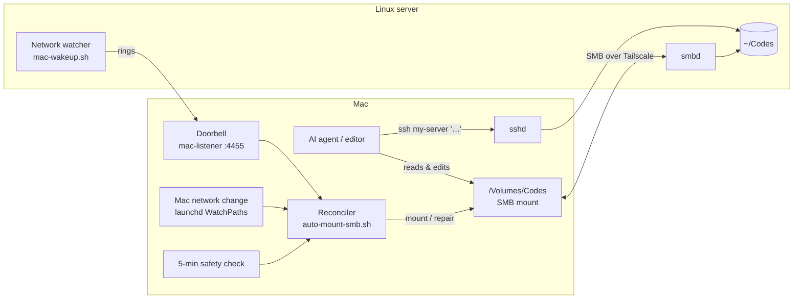

# Agent Remote Workspace

**Let local-only AI agents work on a remote Linux server — files mount on your Mac, commands run on the server, and the connection heals itself.**

[](LICENSE)


Antigravity 2.0's Agent Manager — like several other AI coding tools — **only works on local folders**. There's no "connect to remote host" button. But you want the heavy work (builds, `npm install`, dev servers, Docker, test runs) on a Linux box, not on a laptop that heats up and throttles.

Agent Remote Workspace makes a server folder **look local** to any editor or agent, and keeps it that way:

- 📁 **Your code lives on the server**, shown on the Mac as a normal folder via macOS's built-in SMB client — nothing to install on the Mac side for file access.
- 🖥️ **Every command runs on the server**, enforced in two layers: a **`remote-runner` MCP tool** gives the agent a command runner that only exists on the server (commands passed as plain lists or scripts, so no `ssh '...'` quoting bugs), and a **shell safety net** forwards `npm`, `python`, `git`… typed on the Mac inside the share to the server, even if the agent forgets its rules.
- 🔁 **Self-healing:** Wi-Fi drops, sleep, server reboots — the share comes back **within seconds**, triggered by network events instead of constant polling.
- 🌐 **Previews just work:** `http://localhost:3000` on the Mac opens the dev server running on the Linux box.
- 🧊 **The Mac stays cool:** no local builds, no `node_modules` crawling, nothing running in a loop. The doorbell used 0.25 s of CPU in 5¾ hours ([measured](docs/ARCHITECTURE.md#measured-footprint)).

**Works with** any editor or AI agent that edits local folders and runs terminal commands — the rules file is plain [`AGENTS.md`](agent-rules/AGENTS.md) (copy it as `GEMINI.md` for Gemini/Antigravity, `CLAUDE.md` for Claude Code). Built and tested daily with **Google Antigravity 2.0**.

---

## How it works



1. When the **server's** network changes, it **rings a doorbell** on the Mac (a tiny TCP listener), retrying every second until the Mac answers.
2. When the **Mac's** network changes, macOS itself triggers the same check.
3. A **reconciler** script compares "should be mounted" with "is mounted": it detects frozen mounts, leftover empty folders and missing connections, and fixes each one safely.
4. A **5-minute check** catches anything the events missed. Events make it fast; the check makes it reliable.

➡️ Deep dive: [docs/ARCHITECTURE.md](docs/ARCHITECTURE.md)

## What it handles

| Situation | Result |
|---|---|
| Wi-Fi blip on either side | Remounted in seconds, one check (not a flood) |
| Laptop wakes from sleep | Mac's own network trigger remounts |
| Server reboots | Server rings the Mac as soon as it's back |
| Mount looks connected but is frozen | Detected (3 strikes), safely unmounted, remounted |
| Wake-up arrives mid-check | Queued, one re-check right after (never lost) |
| Server unreachable | One notification, then quiet automatic recovery |
| Agent forgets the rules in a long session and runs `npm run build` on the Mac | Safety net forwards it to the server anyway |
| Command full of quotes, pipes, heredocs, `awk '{print $1}'` | `run_on_server` takes it as written; no escaping layer to break |
| You're done for the day | One click **Toggle Workspace → OFF** (polite eject, asks before forcing) |

## Quick start

You need: a Mac, an Ubuntu server, and [Tailscale](https://tailscale.com) on both.

```bash
git clone https://github.com/manav-bhullar/agent-remote-workspace && cd agent-remote-workspace

# On the server
./install-server.sh        # asks for the Mac's Tailscale IP, sets up the share + network watcher

# On the Mac
./install-mac.sh           # asks for server name/user/share, builds the doorbell, installs background jobs
```

Then: Finder → **Go → Connect to Server** → `smb://you@my-server/Codes` once (saves the password in Keychain), and double-click **Toggle Workspace** on the Desktop.

Copy [`agent-rules/AGENTS.md`](agent-rules/AGENTS.md) to the root of your share (also as `GEMINI.md` for Antigravity, `CLAUDE.md` for Claude Code) so the agent runs every command on the server, and add the `remote-runner` tool to your agent's MCP config ([example](mac/mcp_config.example.json)).

➡️ Manual setup and every option: [docs/SETUP.md](docs/SETUP.md)

## Why not just…?

| Option | Good at | Why it didn't fit here |
|---|---|---|
| **VS Code / Cursor Remote-SSH** | Full remote editor experience | Doesn't help agents that only work locally (e.g. Antigravity 2.0 Agent Manager) |
| **sshfs** | Zero server setup | Needs macFUSE (third-party kernel extension) on macOS; no reconnect logic |
| **Mutagen / Syncthing** | Fast local file access | Keeps **two copies** in sync — conflicts, and huge folders like `node_modules` must be carefully excluded |
| **git push / pull** | Simple, versioned | Manual; edits aren't live on the server |
| **This repo** | Built-in macOS SMB + SSH, single copy of every file, event-driven self-healing | Needs the network; large file trees are slower to browse than a local disk |

## Daily use

| | |
|---|---|
| Start / stop | **Toggle Workspace** on the Desktop |
| Health check | `~/.scripts/auto-mount-smb.sh --status` |
| Mac log | `tail ~/Library/Logs/RemoteWorkspace.log` |
| Server log | `journalctl --user -u mac-wakeup` |
| Dev preview | agent starts it in `tmux` on the server → open `localhost:3000` |

Something off? [docs/TROUBLESHOOTING.md](docs/TROUBLESHOOTING.md)

## Security notes

- Keep SMB and SSH reachable **only over Tailscale** (or another private network). A firewall rule like `ufw allow in on tailscale0` plus `ufw default deny incoming` does this.
- The doorbell ignores anything not coming from a Tailscale address (`100.64.0.0/10`), and a ring can only trigger a health check — never run arbitrary commands.
- The SMB password lives in the macOS Keychain; no secrets are stored in these scripts.

## Contributing

Issues and PRs welcome — especially Linux/Windows clients, other editors, and real-world failure cases. See [CONTRIBUTING.md](CONTRIBUTING.md).

## License

[MIT](LICENSE) © 2026 Manav Bhullar
