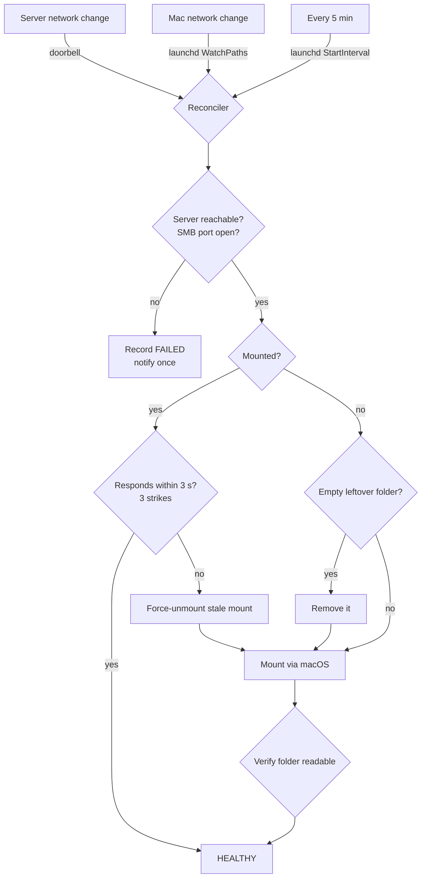
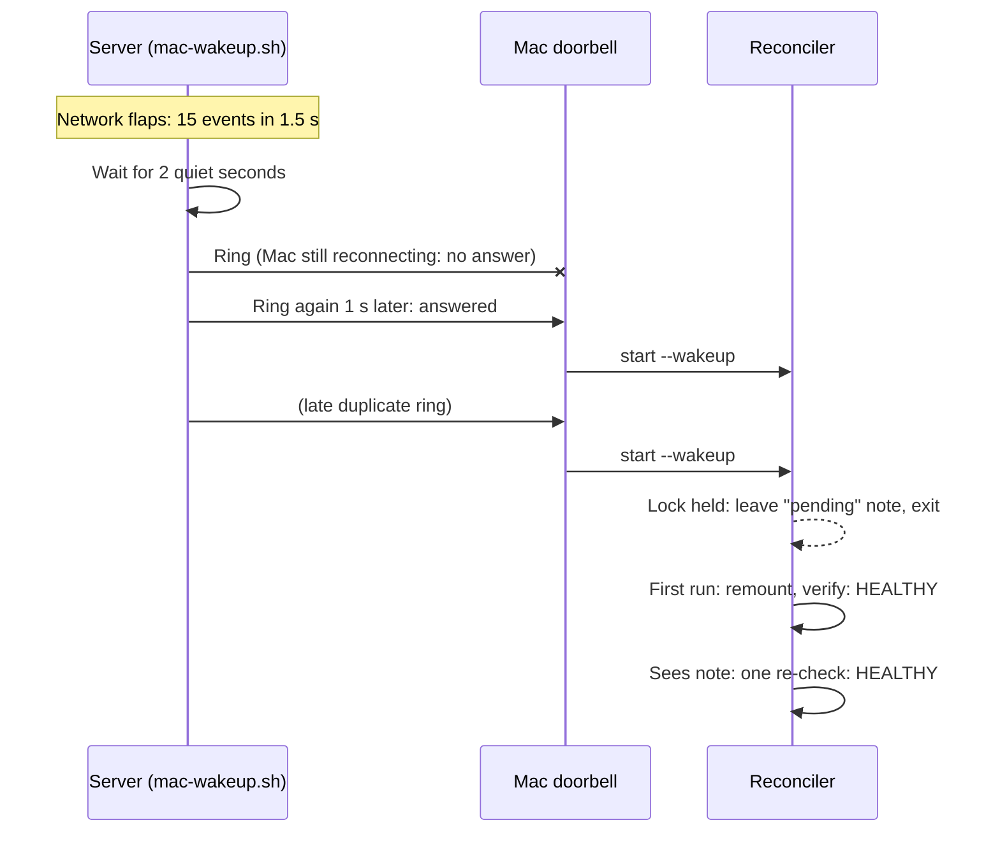

# Architecture

Agent Remote Workspace has one job: **keep a server folder mounted on the Mac, and get it back fast when something breaks** — without burning the Mac's CPU on constant checks.

## Components

| Component | Runs on | Started by | Role |
|---|---|---|---|
| `mac-wakeup.sh` | Server | systemd user service | Watches the server's network; rings the doorbell after changes |
| `mac-listener` | Mac | launchd (`KeepAlive`) | The doorbell: accepts a TCP connection on :4455, starts a check |
| `auto-mount-smb.sh` | Mac | listener / launchd / you | The reconciler: makes "actual" match "desired" |
| `Toggle Workspace.app` | Mac | you | Turns the background parts on/off; polite eject |
| `AGENTS.md` | Share root | the AI agent | Routes every command to the server over SSH |

## The core idea: events nudge, the reconciler decides

A system that acts only on events ("network is back → mount") breaks the first time an event is missed. A system that only polls ("is it mounted? is it mounted?") is reliable but wasteful and slow.

Remote Workspace does what Kubernetes controllers do: **events only say "go look"**. The reconciler always inspects the *current* state from scratch and fixes the difference. Running it twice is harmless; missing an event only delays recovery until the next trigger.

## A Wi-Fi drop, step by step

## Design decisions

**The doorbell carries no message.** A ring means only "check now". There's nothing to parse, nothing to spoof beyond "please run a health check", and nothing that can go stale.

**Rings retry every second, no exponential backoff.** The server is idle and a TCP connect costs nothing; reconnect speed matters more. Retrying stops when the Mac answers or after 5 minutes (sleeping Mac, workspace switched off) — the Mac's own triggers cover the rest.

**Bursts are collapsed.** One Wi-Fi reconnect produces many kernel network events. The server waits for 2 quiet seconds, then rings once.

**Wake-ups are never dropped.** Only one reconciler runs at a time (a `mkdir` lock with owner-PID validation). A wake-up that arrives mid-run leaves a *pending* note; on exit the running instance `exec`s one re-check. `exec` keeps the re-run inside the same launchd job so launchd doesn't kill it as an orphan.

**Every step is time-boxed.** Network filesystems can hang a process in uninterruptible I/O. Every probe (`ping`, `nc`, `stat`, mount) runs with a timeout and the script never waits on a hung child.

**Fail loudly once, then stay quiet.** A notification fires on the first failure, not on every retry — and once on recovery.

**The doorbell can't silently die.** Every socket call is checked; on failure it exits so launchd restarts it, instead of spinning on a dead socket at 100% CPU. It ignores connections that don't come from a Tailscale address.

**OFF never risks your files.** The toggle tries a normal eject first and only force-disconnects after you confirm — a forced unmount mid-save can leave a half-written file.

## From polling to interrupts

| | v1: polling | v2: event-driven (this repo) |
|---|---|---|
| Idle CPU on the Mac | Constant checks | Nothing runs until an event |
| Recovery after a drop | Up to one polling interval | Seconds |
| Missed events | n/a | Caught by the 5-min safety check |
| Duplicate triggers | n/a | Collapsed (server) + queued (Mac) |
